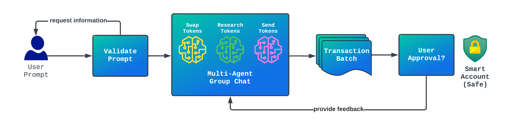

# AutoTx
[Discord](https://discord.gg/k7UCsH3ps9) | :star: the repo !  


AutoTx is a personal assistant that generates on-chain transactions for you. These transactions are submitted to a smart account so users can easily approve & execute them.


> [!WARNING]  
> This project is still early and experimental. Exercise caution when using real funds.  

## How It Works

AutoTx employs a multi-agent orchestration architecture to easily compose functionality. Given a user prompt, AutoTx will create a new shared context amongst all agents in the form of an [Autogen Group Chat](https://microsoft.github.io/autogen/docs/tutorial/conversation-patterns#group-chat). Individual agents will contribute their unique expert opinions to the shared conversation. Agent tools will be selected and run to progressively solve for the goal(s) defined within the user's original prompt.

Agent tools can add transactions to a batch, which will later be proposed to the user's smart account for final approval before being executed on-chain. Currently AutoTx supports [Safe](https://safe.global/) smart accounts. AutoTx uses a locally-stored private key to submit transactions to the user's smart account.



## Agents

Below is a list of existing and anticipated agents that AutoTx can use. If you'd like to help build one of these agents, see the [How To Contribute](#how-to-contribute) section below.

| Agent | Description | Status |
|-|-|-|
| [Send Tokens](./autotx/agents/SendTokensAgent.py) | Send tokens (ERC20 & ETH) to a receiving address. | :rocket: |
| [Swap Tokens](./autotx/agents/SwapTokensAgent.py) | Swap from one token to another. Currently integrated with [Li.Fi](https://docs.li.fi/). | :rocket: |
| [Token Research](./autotx/agents/ResearchTokensAgent.py) | Research tokens, liquidity, prices, graphs, etc. | :rocket: |
| Earn Yield | Stake assets to earn yield. | :memo: [draft](https://github.com/polywrap/AutoTx/issues/98) |
| Bridge Tokens | Bridge tokens from one chain to another. | :memo: [draft](https://github.com/polywrap/AutoTx/issues/46) |
| Social Search | Research accounts, posts, and sentiment across social networks (ex: Twitter, Farcaster) | :memo: [draft](https://github.com/polywrap/AutoTx/issues/204) |
| Web3 Domains | Purchase and manage domains (ex: ENS) | :memo: [draft](https://github.com/polywrap/AutoTx/issues/245) |
| NFTs | Basic NFT integration: mint, transfer, set approval, etc. | :memo: [draft](https://github.com/polywrap/AutoTx/issues/45) |
| NFT Market | NFT marketplace functionality: list, bid, etc. | :thought_balloon: |
| LP | Provide liquidity to AMMs. | :thought_balloon: |
| Governance | Vote or delegate in DAOs. | :thought_balloon: |
| Predict | Generate future predictions based on research. | :thought_balloon: |
| Donate | Donate to public goods projects. | :thought_balloon: |
| Invest | Participate in LBPs, IDOs, etc. | :thought_balloon: |

# Getting Started
## Pre-Requisites
Please install the following:
- [git](https://git-scm.com/book/en/v2/Getting-Started-Installing-Git)
- [python](https://www.python.org/downloads/)
- [poetry](https://python-poetry.org/docs/#installation)
- [docker](https://www.docker.com/)

## Installation
1. Clone the repository via `git clone https://github.com/polywrap/AutoTx` and `cd AutoTx` into the directory.
2. Create a new .env file via `cp .env.example .env`
3. Find the line that says OPENAI_API_KEY=, and add your unique OpenAI API Key `OPENAI_API_KEY=sk-...`
4. (Optional) If you have an Infura/Alchemy API Key, find the line that says CHAIN_RPC_URL=, and update it, for example: `CHAIN_RPC_URL=https://mainnet.infura.io/v3/YOUR_INFURA_KEY` (see https://www.infura.io/ or https://alchemy.com to get your own API key). 
5. (Optional) If you have a Coingecko API Key, find the line that says `COINGECKO_API_KEY=`, and add it `COINGECKO_API_KEY=CG-...` (see [Coingecko API Documentation](https://docs.coingecko.com/reference/setting-up-your-api-key)). Note: Without the Coingecko API Key, the Token Research Agent will not be added to the agent's execution loop.
6. Start a new poetry shell `poetry shell`
7. Install python dependencies `poetry install`

## Using AutoTx

1. Run `poetry run start-devnet` if you want to test locally. More information [below](#test-locally).  
2. Run `poetry run ask` and AutoTx will ask you for a prompt to start solving for (ex: `Send 1 ETH to vitalik.eth`). Prompts can also be passed as an argument (ex: `poetry run ask "..."`).

Additional `run` Options:
* `-v, --verbose` Enable verbose logging.
* `-n, --non-interactive` Disable all requests for user input, as well as the clarifier agent.
* `-l, --logs DIRECTORY`  Path to the directory where logs will be stored.

### Test Locally

Run `poetry run start-devnet` to create a local fork of the network set by the `CHAIN_RPC_URL` env variable. This step required Docker to be running in the background. The devnet includes a new smart account, as well as a development address with test ETH for tx execution. Running `poetry run stop-devnet` will shutdown the local fork.

### Connect a Smart Account

AutoTx can be connected to your existing smart account by doing the following:

1. Set the `SMART_ACCOUNT_ADDRESS` to the address of your smart account in your `.env`. This tells AutoTx which account it should interact with.
2. AutoTx's agent address, which it generates locally, must be set as a signer in your Safe's configuration to allow it to create transactions on behalf of the smart account. To get this address, run `poetry run agent address`.
3. Update the `CHAIN_RPC_URL` value in your `.env` with the correct RPC URL of the network where your smart account is deployed.
4. Run AutoTx as you would normally.

## Prompts
AutoTx currently supports prompts such as:  

| Category | Prompt |
|---|---|
| Token Research | `Research the top AI coins by trading volume.` |
| Token Research | `Conduct a thorough analysis of Worldcoin, including whether to hold or sell` |
| Token Research | `Find leveraged tokens I can buy directly on Ethereum mainnet`  |
| Send Tokens | `Send tokens 1 ETH and 1000 USDC to vitalik.eth` |
| Swap Tokens | `Buy 100 USDC with ETH` |
| Multi Task | `Identify the top AI coins by trading volume on Ethereum mainnet. Buy 1 ETH of the top 2.` |
| Multi Task| `Swap ETH to 0.05 WBTC, then swap WBTC to 1000 USDC, and finally send 50 USDC to vitalik.eth` |
| Multi Task, Airdrop | `Buy 10 WLD with ETH, then send the WLD in equal amounts to each of these addresses: vitalik.eth, abc.eth, and maxi.eth` |
| Multi Task, Airdrop | `Buy 1 ETH of the highest mcap meme coin on ethereum mainnet, then airdrop it in equal parts to: vitalik.eth, abc.eth, and maxi.eth` |
| Multi Task, Strategy | `I want to use 3 ETH to purchase 10 of the best projects in: GameFi, NFTs, ZK, AI, and MEMEs. Please research the top projects, come up with a strategy, and purchase the tokens that look most promising. All of this should be on ETH mainnet.` |

Future possibilities:
* `Purchase mainnet ETH with my USDC on optimism`
* `What proposals are being voted on right now?`
* `Donate $100 to environmental impact projects`
* ...

## Use AutoTx With Open-Source Models

To run AutoTx with your favorite OS model, you can use any provider that simulates the OpenAI API. One of the easiest way to do this is using [together.ai](https://docs.together.ai/docs/quickstart) and following these steps:  
1. Make a together.ai account.
1. Set `OPENAI_API_KEY` in the `.env` file to your together.ai account's API key ([found here](https://api.together.xyz/settings/api-keys))
1. Set `OPENAI_BASE_URL` to point to `https://api.together.xyz/v1`
1. Set `OPENAI_MODEL_NAME` to one of these recommended JSON-enabled models: `mistralai/Mixtral-8x7B-Instruct-v0.1`, `mistralai/Mistral-7B-Instruct-v0.1`

Now simply run AutoTx as normally do. For more tips on choosing the best model, you can follow [this guide](https://microsoft.github.io/autogen/docs/topics/non-openai-models/best-tips-for-nonopenai-models/).
NOTE: Non-interactive mode is recommended when using less powerful models (like Open Source models) to avoid hallucinations.

## How To Contribute
Interested in contributing to AutoTx? Here are some ideas:
* Contribute prompt ideas above
* Build an [agent](#agents)
* Discuss AutoTx's future in [issues](https://github.com/polywrap/AutoTx/issues)

Connect with us on [Discord](https://discord.gg/k7UCsH3ps9) if you have any questions or ideas to share.

## Building Agents

To add agents to AutoTx, we recommend starting with the [`ExampleAgent.py`](./autotx/agents/ExampleAgent.py) starter template. From there you'll want to:
1. Define the agent's `name` and `system_message`.
1. Implement the tools (functions) you want the agent to be able to call.
1. Add all tools to the agent's `tools=[...]` array.
1. Add your new agent to `AutoTx`'s constructor in [`cli.py`](./autotx/cli.py).

### Testing

Tests are located in the [`./autotx/tests`](./autotx/tests/) directory.

Use the following commands to run your tests:
```bash
# run all tests
poetry run pytest -s

# run a specific file
poetry run pytest -s ./autotx/tests/file_name.py

# run a specific test
poetry run pytest -s ./autotx/tests/file_name.py::function_name
```

Additionally you can run benchmarks to measure consistency:
```bash
# run tests in a directory with 5 iterations each
python benchmarks.py ./autotx/tests/dir_name 5

# run tests in a file with 5 iterations each
python benchmarks.py ./autotx/tests/file_name.py 5

# run a specific test with 5 iterations
python benchmarks.py ./autotx/tests/file_name.py::function_name 5

# run a specific test with 5 iterations and name the output folder (instead of the default timestamp)
python benchmarks.py ./autotx/tests/file_name.py::function_name 5 output_folder_name
```

# API Server
To view the API server documentation, please see the [API.md](./API.md) file.

## Need Help?

Join our [Discord community](https://discord.gg/k7UCsH3ps9) for support and discussions.

[](https://discord.com/invite/k7UCsH3ps9)

If you have questions or encounter issues, please don't hesitate to [create a new issue](https://github.com/polywrap/AutoTx/issues/new) to get support.
